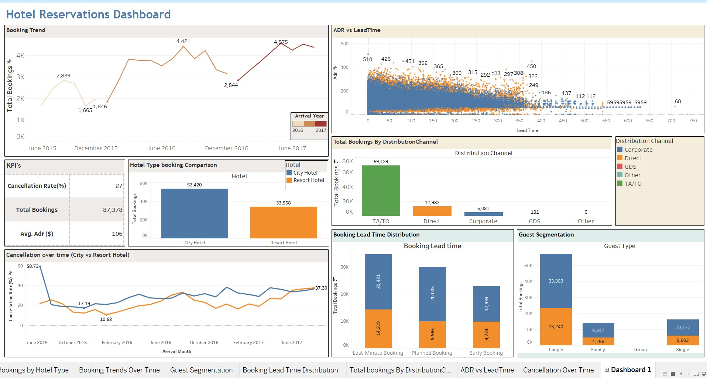

# 🏨 Hotel Booking Demand & Cancellation Analysis

This project explores the key factors influencing hotel booking cancellations using in-depth exploratory data analysis (EDA) techniques in Python. It reveals patterns across hotel types, customer behaviors, booking channels, and seasonality, helping stakeholders reduce cancellation rates and improve revenue forecasting.

---

## 📌 Objective

To analyze hotel booking data and uncover actionable insights that can help reduce cancellations, improve pricing strategies, and increase customer satisfaction.

---

## 📊 Tools & Technologies

- **Python**: Pandas, NumPy, Matplotlib, Seaborn
- **Jupyter Notebook**: Interactive development and documentation
- **Tableau**: Summary dashboard for stakeholders
- **Excel**: Preliminary review of dataset and summary statistics

---

## 🔍 Key Insights & Findings

- **City Hotels have higher cancellation rates (41.7%)** compared to Resort Hotels (27.7%).
- **Longer lead times** are associated with higher cancellation probability.
- **Transient customers and group bookings** are the most likely to cancel.
- **No-deposit bookings** show the highest cancellation rates.
- **Guests with special requests are less likely to cancel**, indicating stronger intent to stay.
- **Most bookings are for 1–2 guests**, with seasonal peaks in July and August.

---

## 📈 Visualizations

The project includes **20+ structured visualizations** under:

- **Univariate Analysis** – Understand individual variable distributions  
- **Bivariate Analysis** – Compare relationships between pairs (e.g., lead time vs. cancellations)  
- **Multivariate Analysis** – Explore 3-variable relationships (e.g., ADR vs. Lead Time vs. Hotel Type)

Each visualization includes:
- Chart type reasoning
- Insights gained
- Business impact interpretation

---

## 📈 Tableau Summary Dashboard

> The dashboard highlights booking trends, ADR vs. lead time, guest segmentation, and key KPIs including cancellation rate and average daily rate.

---

## 📁 Files in the Repository

- `EDA_Hotel_Booking_Analysis.ipynb`: Full analysis notebook with code, plots, and insights
- `cleaned_booking_data.csv`: Processed dataset after handling missing values and feature engineering
- `hotel_booking_dashboard.twbx`: Tableau dashboard file
- `README.md`: Project overview

---

## ✅ Business Recommendations

- Enforce **non-refundable policies** for long lead-time or high-risk customer segments.
- Use **dynamic pricing** to optimize revenue during low-demand months.
- Focus marketing efforts on **low-cancellation segments** (e.g., contract customers, families).
- Provide **incentives for short lead-time bookings** and **special request customers**.

